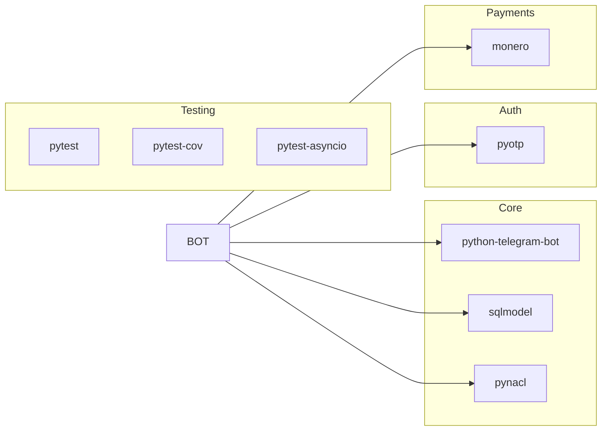

# Dependencies

## Core Dependencies

| Package | Version | Purpose |
|---------|---------|---------|
| python-telegram-bot | 20.3 | Telegram Bot API wrapper |
| sqlmodel | latest | SQLAlchemy + Pydantic ORM |
| pynacl | latest | libsodium encryption |
| pyotp | latest | TOTP authentication |
| monero | latest | Monero wallet RPC client |

## Dependency Graph



## External Services

### Telegram Bot API

- **Endpoint**: api.telegram.org
- **Auth**: Bot token from @BotFather
- **Rate Limits**: 30 messages/second (broadcast), 1 message/second/chat

### Monero Wallet RPC

- **Default Port**: 18082
- **Protocol**: JSON-RPC 2.0
- **Required Methods**: `make_integrated_address`, `get_transfers`

## Configuration

All external dependencies are configured via environment variables:

```python
# Required
TELEGRAM_TOKEN      # Bot API token
ENCRYPTION_KEY      # 32-byte base64 key for PyNaCl

# Optional (enables features)
MONERO_RPC_URL      # Falls back to mock mode if not set
TOTP_SECRET         # Disables 2FA if not set
```

## Mock Mode

When `MONERO_RPC_URL` is not configured, the payment service operates in mock mode:

```python
class PaymentService:
    def __init__(self, rpc_url: str | None = None):
        self.mock_mode = rpc_url is None

    async def create_payment(self, amount: Decimal) -> PaymentDetails:
        if self.mock_mode:
            return self._mock_payment(amount)
        return await self._real_payment(amount)
```

This allows development and testing without a running Monero node.

## Security Considerations

- **pynacl**: Uses libsodium's authenticated encryption (XSalsa20-Poly1305)
- **pyotp**: TOTP tokens valid for 30 seconds with 1-step tolerance
- **sqlmodel**: Parameterized queries prevent SQL injection
