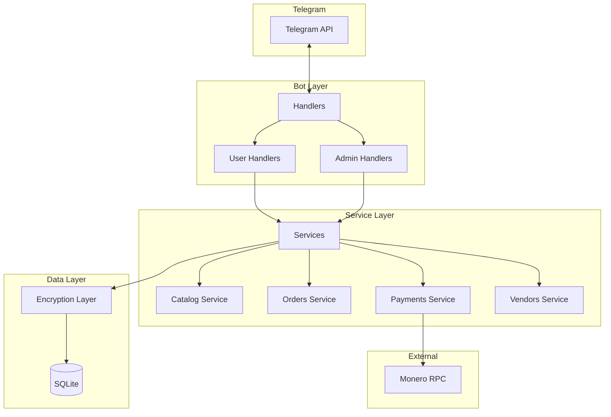
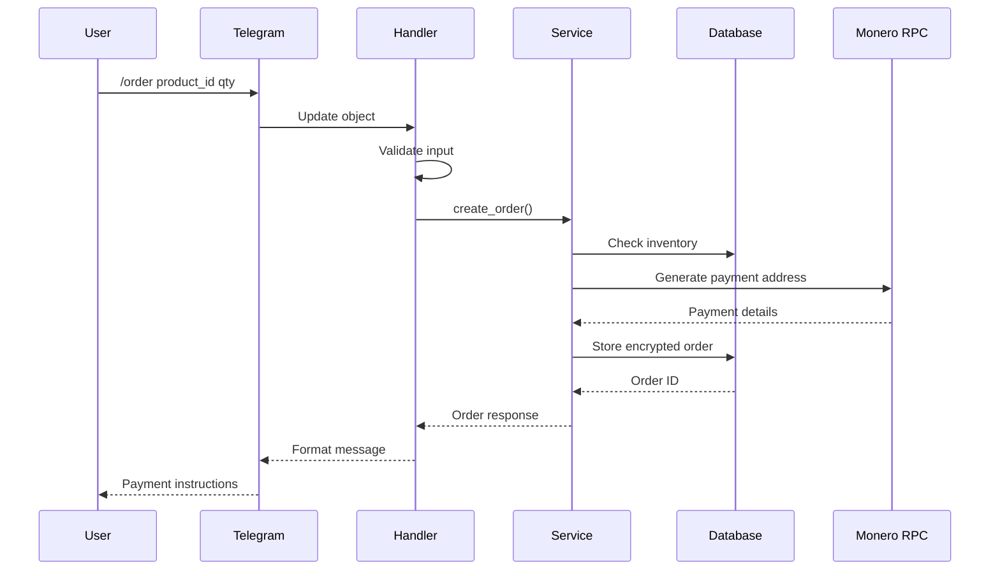

# Architecture Overview

## System Design

The bot follows a modular, service-oriented architecture with clear separation between Telegram handlers and business logic.

## Component Responsibilities

### Handlers (`bot/handlers/`)

Thin layer responsible for:
- Parsing Telegram messages and commands
- Input validation
- Calling appropriate services
- Formatting responses for Telegram

Handlers should not contain business logic.

### Services (`bot/services/`)

Business logic layer handling:
- **catalog.py**: Product CRUD operations
- **orders.py**: Order creation and management
- **payments.py**: Monero wallet integration
- **vendors.py**: Multi-vendor management

### Models (`bot/models.py`)

SQLModel definitions with:
- Field validation
- Encryption decorators for sensitive data
- Relationship definitions

## Data Flow

## Design Principles

1. **Single Responsibility**: Each module handles one concern
2. **Dependency Injection**: Services receive dependencies via constructors
3. **Fail-Safe Defaults**: Mock mode when external services unavailable
4. **Encryption by Default**: Sensitive data never stored in plaintext
