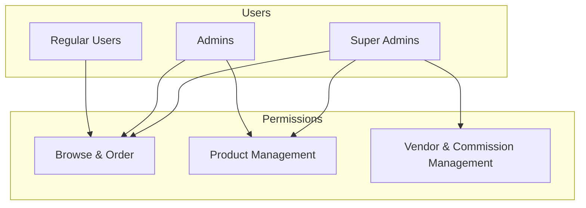
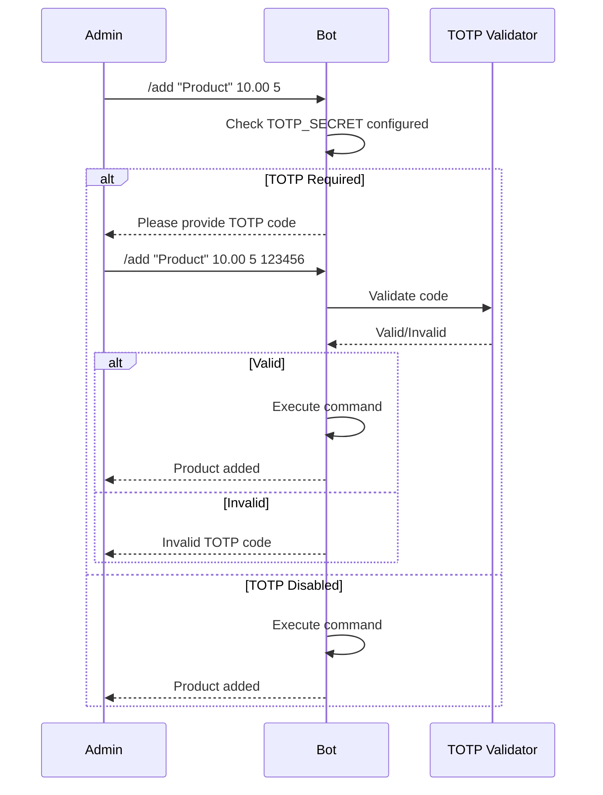

# Authentication Overview

## Authentication Model

The bot implements a two-tier admin system with optional TOTP two-factor authentication.



## User Roles

### Regular Users
- Browse product catalog
- Search products
- Place orders
- View order status

### Admins
- All user capabilities
- Add/edit/remove products
- View orders for their products
- Configured via `ADMIN_IDS` environment variable

### Super Admins
- All admin capabilities
- Manage vendors
- Set commission rates
- Platform-wide access
- Configured via `SUPER_ADMIN_IDS` environment variable

## TOTP Authentication

Optional two-factor authentication protects admin commands.

### Flow



### Configuration

```bash
# Generate TOTP secret
python -c "import pyotp; print(pyotp.random_base32())"

# Set in environment
TOTP_SECRET=JBSWY3DPEHPK3PXP
```

### Code Implementation

```python
import pyotp

def verify_totp(code: str, secret: str) -> bool:
    totp = pyotp.TOTP(secret)
    return totp.verify(code, valid_window=1)
```

The `valid_window=1` parameter allows codes from 30 seconds before/after to account for clock drift.

## Authorization Checks

Authorization is checked at the handler level:

```python
from functools import wraps

def admin_required(func):
    @wraps(func)
    async def wrapper(update: Update, context: ContextTypes.DEFAULT_TYPE):
        user_id = update.effective_user.id
        if user_id not in settings.admin_ids:
            await update.message.reply_text("Unauthorized")
            return
        return await func(update, context)
    return wrapper

def super_admin_required(func):
    @wraps(func)
    async def wrapper(update: Update, context: ContextTypes.DEFAULT_TYPE):
        user_id = update.effective_user.id
        if user_id not in settings.super_admin_ids:
            await update.message.reply_text("Unauthorized")
            return
        return await func(update, context)
    return wrapper
```

## Security Properties

1. **No Password Storage**: Uses Telegram user IDs for identity
2. **Time-Based Codes**: TOTP codes expire after 30 seconds
3. **Centralized Configuration**: Admin IDs managed via environment
4. **Fail-Closed**: Missing TOTP fails authentication
