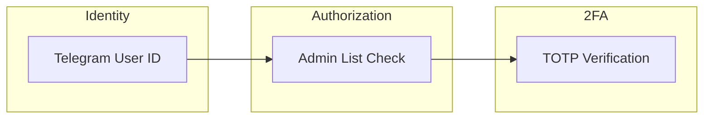

# Security Model

## Threat Model

### Assets to Protect

1. **User Data**: Encrypted delivery addresses, order history
2. **Payment Information**: Monero addresses, transaction details
3. **Bot Credentials**: Telegram token, encryption keys
4. **Business Data**: Product inventory, vendor information

### Threat Actors

| Actor | Capability | Mitigation |
|-------|------------|------------|
| Curious User | Message enumeration | Rate limiting, access control |
| Rogue Admin | Data exfiltration | TOTP 2FA, audit logging |
| Database Access | SQLite file access | Encryption at rest |
| Network Observer | Traffic analysis | Telegram's encryption |

## Security Controls

### Authentication Controls



### Data Protection

**Encryption at Rest**

All sensitive data fields are encrypted before storage:

```python
# Encrypted fields
Order.delivery_address  # User's delivery info
Order.notes            # Order notes
```

**Encryption Algorithm**: XSalsa20-Poly1305 (via libsodium)
- 256-bit key
- Authenticated encryption (tamper detection)
- Unique nonce per encryption

### Input Validation

All user input is validated before processing:

```python
def validate_product_name(name: str) -> str:
    if not name or len(name) > 100:
        raise ValidationError("Invalid product name")
    # Sanitize for Telegram markdown
    return name.replace("*", "").replace("_", "")

def validate_quantity(qty: str) -> int:
    try:
        value = int(qty)
        if value <= 0 or value > 1000:
            raise ValidationError("Quantity must be 1-1000")
        return value
    except ValueError:
        raise ValidationError("Invalid quantity")
```

### SQL Injection Prevention

SQLModel/SQLAlchemy use parameterized queries:

```python
# Safe - parameterized
statement = select(Product).where(Product.name == search_term)

# Never do this
# f"SELECT * FROM product WHERE name = '{search_term}'"
```

## Secret Management

### Required Secrets

| Secret | Purpose | Generation |
|--------|---------|------------|
| `TELEGRAM_TOKEN` | Bot API auth | From @BotFather |
| `ENCRYPTION_KEY` | Data encryption | `openssl rand -base64 32` |
| `TOTP_SECRET` | Admin 2FA | `python -c "import pyotp; print(pyotp.random_base32())"` |

### Key Rotation

Encryption key rotation requires data migration:

```python
def rotate_encryption_key(old_key: bytes, new_key: bytes):
    with Session(engine) as session:
        orders = session.exec(select(Order)).all()
        for order in orders:
            # Decrypt with old key
            plaintext = decrypt(order.delivery_address, old_key)
            # Re-encrypt with new key
            order.delivery_address = encrypt(plaintext, new_key)
        session.commit()
```

## Audit Logging

Security-relevant events are logged:

```python
import logging

security_logger = logging.getLogger("security")

def log_admin_action(user_id: int, action: str, details: dict):
    security_logger.info(
        "admin_action",
        extra={
            "user_id": user_id,
            "action": action,
            "details": details,
            "timestamp": datetime.utcnow().isoformat()
        }
    )
```

## Security Checklist

- [ ] Encryption key is 32 bytes and securely generated
- [ ] TOTP is enabled for production
- [ ] Admin IDs are correctly configured
- [ ] Database file has restricted permissions
- [ ] Logs don't contain sensitive data
- [ ] Bot token is not committed to version control
- [ ] Rate limiting is enabled
- [ ] Error messages don't leak internal details
