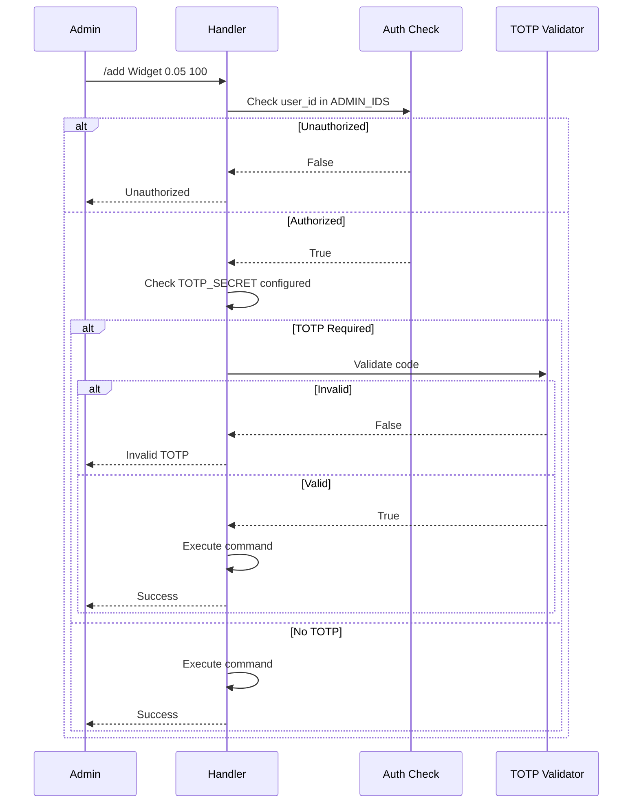

# Admin Commands

## Admin Command Reference

All admin commands require the user's Telegram ID to be in `ADMIN_IDS` or `SUPER_ADMIN_IDS`. If TOTP is configured via `TOTP_SECRET`, commands require a valid code as the last argument.

### /add

Add a new product to the catalog. Requires the admin to be a registered vendor.

**Usage**: `/add <name> <price> <inventory> [totp]`

**Arguments**:
| Argument | Required | Description |
|----------|----------|-------------|
| name | Yes | Product name |
| price | Yes | Price in XMR (float) |
| inventory | Yes | Initial stock quantity |
| totp | Conditional | TOTP code if 2FA enabled |

**Examples**:
```
/add Widget 0.05 100
/add Widget 0.05 100 123456    # With TOTP
```

**Response**:
```
Added Widget
```

**Note**: Admin must be registered as a vendor first. Returns "Vendor not registered" otherwise.

**Handler**: `bot/handlers/admin.py:add`

---

## Super Admin Commands

These commands require the user's Telegram ID to be in `SUPER_ADMIN_IDS`.

### /addvendor

Register a new vendor.

**Usage**: `/addvendor <telegram_id> <name> [totp]`

**Arguments**:
| Argument | Required | Description |
|----------|----------|-------------|
| telegram_id | Yes | Vendor's Telegram user ID |
| name | Yes | Vendor display name |
| totp | Conditional | TOTP code if 2FA enabled |

**Examples**:
```
/addvendor 123456789 AcmeStore
/addvendor 123456789 AcmeStore 654321
```

**Response**:
```
Vendor AcmeStore added with id 3
```

**Handler**: `bot/handlers/admin.py:add_vendor`

---

### /vendors

List all registered vendors.

**Usage**: `/vendors [totp]`

**Response**:
```
1: AcmeStore rate 0.05
2: BestGoods rate 0.03
```

Returns "No vendors" if none registered.

**Handler**: `bot/handlers/admin.py:list_vendors`

---

### /commission

Set vendor commission rate.

**Usage**: `/commission <vendor_id> <rate> [totp]`

**Arguments**:
| Argument | Required | Description |
|----------|----------|-------------|
| vendor_id | Yes | Vendor ID (from /vendors) |
| rate | Yes | Commission rate as decimal (0.05 = 5%) |
| totp | Conditional | TOTP code if 2FA enabled |

**Examples**:
```
/commission 3 0.10       # Set 10% commission
/commission 3 0.05 123456
```

**Response**:
```
Vendor AcmeStore commission set to 0.1
```

**Handler**: `bot/handlers/admin.py:set_commission`

---

## Authorization Flow



## TOTP Usage

When `TOTP_SECRET` is configured, append the 6-digit code:

```
# Without TOTP
/add Widget 0.05 100

# With TOTP
/add Widget 0.05 100 123456
```

Generate codes using any TOTP app (Google Authenticator, Authy, etc.) configured with the `TOTP_SECRET`.
