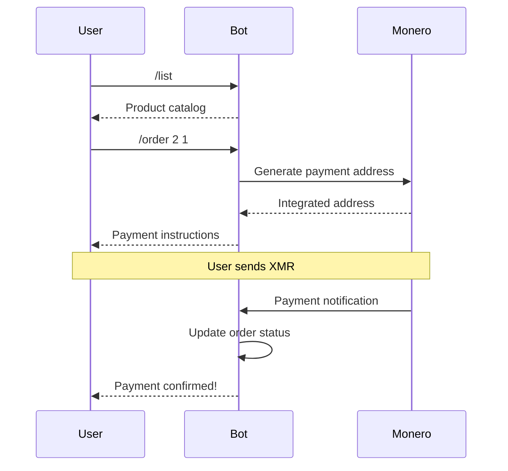

# Command Examples

## User Workflow Examples

### Browsing and Ordering

```
User: /start

Bot: Welcome to CryptoShop!

Browse our products with /list
Place an order with /order <id> <quantity>

All payments accepted in Monero (XMR).

---

User: /list

Bot: Available Products:

1. Basic Widget
   Price: 0.05 XMR
   In stock: 50

2. Premium Widget
   Price: 0.15 XMR
   In stock: 20

3. Deluxe Package
   Price: 0.50 XMR
   In stock: 5

Use /order <id> <quantity> to purchase

---

User: /list premium

Bot: Search results for "premium":

2. Premium Widget
   Price: 0.15 XMR
   In stock: 20

---

User: /order 2 3 123 Main Street, City

Bot: Order #456 created!

Amount: 0.45 XMR
Send to: `4A1234567890...`

Please send the exact amount to the address above.
Your order will be processed once payment is confirmed.
```

### Order Error Handling

```
User: /order 999 1

Bot: Product not found. Use /list to see available products.

---

User: /order 1 1000

Bot: Insufficient inventory. Only 50 available.

---

User: /order abc def

Bot: Invalid input. Usage: /order <product_id> <quantity>
```

## Admin Workflow Examples

### Product Management

```
Admin: /add CryptoStickerPack 0.02 200

Bot: Added CryptoStickerPack
```

Note: Admin must be registered as a vendor first via `/addvendor`.

### With TOTP Authentication

When `TOTP_SECRET` is configured, append the 6-digit code:

```
Admin: /add SecureItem 1.00 10 847291

Bot: Added SecureItem
```

Without the TOTP code, the command silently fails (no response).

## Super Admin Workflow Examples

### Vendor Management

```
SuperAdmin: /addvendor 123456789 TechGadgets

Bot: Vendor TechGadgets added with id 4

---

SuperAdmin: /vendors

Bot: 1: CryptoMerch rate 0.05
2: DigitalGoods rate 0.03
3: TechGadgets rate 0.05

---

SuperAdmin: /commission 3 0.03

Bot: Vendor TechGadgets commission set to 0.03
```

## Complete Transaction Flow



## Error Scenarios

### Rate Limiting

```
User: /list
User: /list
User: /list
... (rapid requests)

Bot: Please wait before sending more commands.
     Try again in 45 seconds.
```

### Unauthorized Admin Access

```
RegularUser: /add HackerProduct 0.01 999

(No response - command silently ignored for non-admins)
```

### Invalid TOTP

```
Admin: /add Product 0.05 10 000000

(No response - invalid TOTP silently fails)
```

Note: The bot fails silently on authorization failures to avoid information disclosure.
