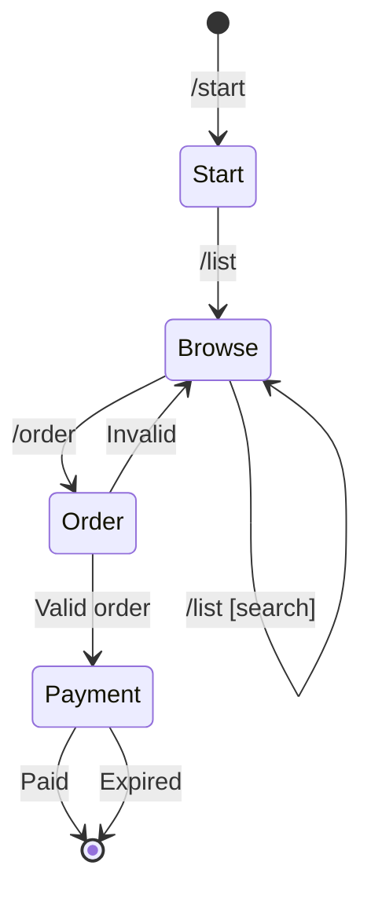

# User Commands

## Command Reference

### /start

Displays welcome message and basic instructions.

**Usage**: `/start`

**Response**:
```
Welcome to [Store Name]!

Browse our products with /list
Place an order with /order <id> <quantity>

All payments accepted in Monero (XMR).
```

**Handler**: `bot/handlers/user.py:start`

---

### /list

Browse available products with optional search.

**Usage**: `/list [search_term]`

**Arguments**:
| Argument | Required | Description |
|----------|----------|-------------|
| search_term | No | Filter products by name |

**Examples**:
```
/list              # Show all products
/list shirt        # Search for "shirt"
```

**Response Format**:
```
Available Products:

1. Product Name
   Price: 0.05 XMR
   In stock: 10

2. Another Product
   Price: 0.10 XMR
   In stock: 5

Use /order <id> <quantity> to purchase
```

**Handler**: `bot/handlers/user.py:list_products`

---

### /order

Place an order for a product.

**Usage**: `/order <product_id> <quantity> <delivery_address>`

**Arguments**:
| Argument | Required | Description |
|----------|----------|-------------|
| product_id | Yes | Product ID from /list |
| quantity | Yes | Number of items |
| delivery_address | Yes | Delivery address (can contain spaces) |

**Examples**:
```
/order 1 2 123 Main St, City    # Order 2 of product #1
```

**Response Format**:
```
Order #123 created!

Amount: 0.10 XMR
Send to: [integrated_address]

Please send the exact amount to the address above.
Your order will be processed once payment is confirmed.
```

**Error Responses**:
- `Invalid product ID or quantity` - Non-numeric values
- `No products found` - Product doesn't exist
- Usage message if wrong number of arguments

**Handler**: `bot/handlers/user.py:order`

---

### /help

Display help information.

**Usage**: `/help`

**Response**:
```
Available Commands:

/start - Welcome message
/list [search] - Browse products
/order <id> <qty> - Place order
/help - This message

Need support? Contact @support_username
```

**Handler**: `bot/handlers/user.py:help_handler`

---

## Command Flow



## Input Validation

All user commands validate input before processing:

```python
async def order_handler(update: Update, context: ContextTypes.DEFAULT_TYPE):
    args = context.args
    if len(args) != 2:
        await update.message.reply_text(
            "Usage: /order <product_id> <quantity>"
        )
        return

    try:
        product_id = int(args[0])
        quantity = int(args[1])
    except ValueError:
        await update.message.reply_text("Invalid product ID or quantity")
        return

    if quantity <= 0 or quantity > 100:
        await update.message.reply_text("Quantity must be 1-100")
        return

    # Process valid order...
```

## Rate Limiting

User commands are rate-limited to prevent abuse:

- **Window**: 60 seconds
- **Max Requests**: 10 per window
- **Response**: "Please wait before sending more commands"
