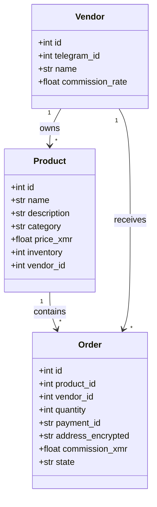

# Data Models

## SQLModel Definitions

### Vendor Model

```python
from sqlmodel import SQLModel, Field
from typing import Optional
from datetime import datetime

class Vendor(SQLModel, table=True):
    """Store vendor information."""

    id: Optional[int] = Field(default=None, primary_key=True)
    telegram_id: int
    name: str
    commission_rate: float = 0.05
    created_at: datetime = Field(default_factory=datetime.utcnow)
```

### Product Model

```python
class Product(SQLModel, table=True):
    """Product item."""

    id: Optional[int] = Field(default=None, primary_key=True)
    name: str
    description: str
    category: Optional[str] = None
    price_xmr: float
    media_id: Optional[str] = None
    inventory: int = 0
    vendor_id: int = Field(foreign_key="vendor.id")
    created_at: datetime = Field(default_factory=datetime.utcnow)
```

### Order Model

```python
class Order(SQLModel, table=True):
    """Customer order."""

    id: Optional[int] = Field(default=None, primary_key=True)
    product_id: int = Field(foreign_key="product.id")
    vendor_id: int = Field(foreign_key="vendor.id")
    quantity: int
    payment_id: str
    address_encrypted: str  # Encrypted delivery address
    commission_xmr: float = 0.0
    state: str = "NEW"  # NEW, PAID, SHIPPED, COMPLETED
    created_at: datetime = Field(default_factory=datetime.utcnow)
```

## Validation

### Field Validators

```python
from pydantic import field_validator

class Product(SQLModel, table=True):
    # ... fields ...

    @field_validator("price")
    @classmethod
    def validate_price(cls, v: Decimal) -> Decimal:
        if v <= 0:
            raise ValueError("Price must be positive")
        if v > Decimal("1000000"):
            raise ValueError("Price exceeds maximum")
        return v

    @field_validator("name")
    @classmethod
    def validate_name(cls, v: str) -> str:
        if not v.strip():
            raise ValueError("Name cannot be empty")
        return v.strip()[:100]
```

### Business Logic Validation

```python
class Order(SQLModel, table=True):
    # ... fields ...

    def validate_quantity(self, product: Product) -> None:
        if self.quantity > product.inventory:
            raise InsufficientInventoryError(
                f"Requested {self.quantity}, available {product.inventory}"
            )

    def calculate_total(self, product: Product) -> Decimal:
        return product.price * self.quantity
```

## Query Patterns

### Common Queries

```python
from sqlmodel import Session, select

# Get all products
def get_products(session: Session) -> list[Product]:
    statement = select(Product)
    return session.exec(statement).all()

# Search products by name
def search_products(session: Session, term: str) -> list[Product]:
    statement = select(Product).where(
        Product.name.ilike(f"%{term}%")
    )
    return session.exec(statement).all()

# Get products with inventory
def get_available_products(session: Session) -> list[Product]:
    statement = select(Product).where(Product.inventory > 0)
    return session.exec(statement).all()

# Get orders by state
def get_orders_by_state(session: Session, state: str) -> list[Order]:
    statement = select(Order).where(Order.state == state)
    return session.exec(statement).all()

# Get order by payment ID
def get_order_by_payment_id(session: Session, payment_id: str) -> Order | None:
    statement = select(Order).where(Order.payment_id == payment_id)
    return session.exec(statement).first()
```

## Model Relationships


