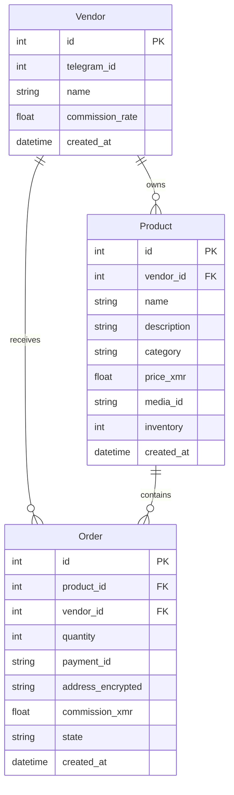

# Database Schema

## Overview

The bot uses SQLite with SQLModel ORM for data persistence. Sensitive fields are encrypted at rest using libsodium.

## Entity Relationship Diagram



## Tables

### vendors

Stores vendor/seller information.

| Column | Type | Constraints | Description |
|--------|------|-------------|-------------|
| id | INTEGER | PRIMARY KEY | Auto-increment ID |
| telegram_id | INTEGER | UNIQUE, NOT NULL | Vendor's Telegram user ID |
| name | VARCHAR(100) | NOT NULL | Display name |
| commission_rate | DECIMAL(4,4) | DEFAULT 0.05 | Platform commission (0-1) |
| created_at | DATETIME | DEFAULT NOW | Registration timestamp |

**Indexes**:
- `idx_vendor_telegram_id` on `telegram_id`

### products

Product catalog with inventory tracking.

| Column | Type | Constraints | Description |
|--------|------|-------------|-------------|
| id | INTEGER | PRIMARY KEY | Auto-increment ID |
| vendor_id | INTEGER | FOREIGN KEY | Reference to vendors.id |
| name | VARCHAR | NOT NULL | Product name |
| description | VARCHAR | NOT NULL | Product description |
| category | VARCHAR | NULLABLE | Product category |
| price_xmr | FLOAT | NOT NULL | Price in XMR |
| media_id | VARCHAR | NULLABLE | Telegram media ID for product image |
| inventory | INTEGER | DEFAULT 0 | Available quantity |
| created_at | DATETIME | DEFAULT NOW | Creation timestamp |

**Indexes**:
- `idx_product_vendor` on `vendor_id`

### orders

Order records with encrypted sensitive data.

| Column | Type | Constraints | Description |
|--------|------|-------------|-------------|
| id | INTEGER | PRIMARY KEY | Auto-increment ID |
| product_id | INTEGER | FOREIGN KEY | Reference to products.id |
| vendor_id | INTEGER | FOREIGN KEY | Reference to vendors.id |
| quantity | INTEGER | NOT NULL | Ordered quantity |
| payment_id | VARCHAR | NOT NULL | Unique payment ID for tracking |
| address_encrypted | TEXT | NOT NULL | Encrypted delivery address |
| commission_xmr | FLOAT | DEFAULT 0.0 | Platform commission amount |
| state | VARCHAR | DEFAULT 'NEW' | Order state (NEW/PAID/SHIPPED/COMPLETED) |
| created_at | DATETIME | DEFAULT NOW | Order timestamp |

**Indexes**:
- `idx_order_payment_id` on `payment_id`
- `idx_order_state` on `state`

## Schema Evolution

### Initial Schema (v1)

```sql
CREATE TABLE vendors (
    id INTEGER PRIMARY KEY AUTOINCREMENT,
    telegram_id INTEGER NOT NULL,
    name VARCHAR NOT NULL,
    commission_rate FLOAT DEFAULT 0.05,
    created_at DATETIME DEFAULT CURRENT_TIMESTAMP
);

CREATE TABLE products (
    id INTEGER PRIMARY KEY AUTOINCREMENT,
    vendor_id INTEGER REFERENCES vendors(id),
    name VARCHAR NOT NULL,
    description VARCHAR NOT NULL,
    category VARCHAR,
    price_xmr FLOAT NOT NULL,
    media_id VARCHAR,
    inventory INTEGER DEFAULT 0,
    created_at DATETIME DEFAULT CURRENT_TIMESTAMP
);

CREATE TABLE orders (
    id INTEGER PRIMARY KEY AUTOINCREMENT,
    product_id INTEGER REFERENCES products(id),
    vendor_id INTEGER REFERENCES vendors(id),
    quantity INTEGER NOT NULL,
    payment_id VARCHAR NOT NULL,
    address_encrypted TEXT NOT NULL,
    commission_xmr FLOAT DEFAULT 0.0,
    state VARCHAR DEFAULT 'NEW',
    created_at DATETIME DEFAULT CURRENT_TIMESTAMP
);
```

## Data Retention

Orders and user data are subject to configurable retention:

```python
DATA_RETENTION_DAYS = 30  # Default

async def cleanup_old_orders():
    cutoff = datetime.utcnow() - timedelta(days=DATA_RETENTION_DAYS)
    statement = delete(Order).where(Order.created_at < cutoff)
    session.exec(statement)
```
