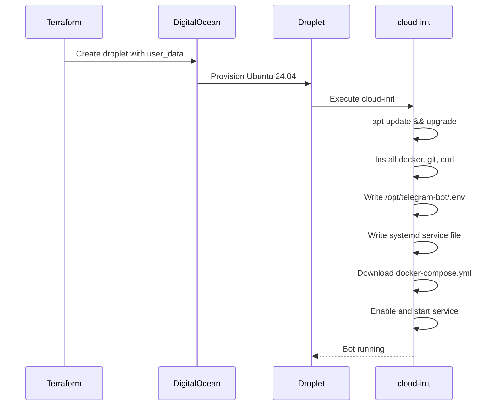

# Deployment Process

## Cloud-Init Bootstrap

When the droplet is created, cloud-init runs automatically:



## Bootstrap Steps

1. **Package Installation**
   - docker.io
   - docker-compose
   - git, curl

2. **File Creation**
   - `/opt/telegram-bot/.env` - Environment variables
   - `/etc/systemd/system/telegram-bot.service` - Service definition

3. **Service Setup**
   - Download docker-compose.yml from GitHub
   - Enable Docker service
   - Enable and start telegram-bot service

## Systemd Service

```ini
[Unit]
Description=Telegram Bot
After=docker.service
Requires=docker.service

[Service]
Type=simple
WorkingDirectory=/opt/telegram-bot
ExecStart=/usr/bin/docker-compose up
ExecStop=/usr/bin/docker-compose down
Restart=always
RestartSec=10

[Install]
WantedBy=multi-user.target
```

## Post-Deployment Verification

```bash
# SSH into server
ssh root@<droplet_ip>

# Check service status
systemctl status telegram-bot

# View logs
journalctl -u telegram-bot -f

# Check Docker containers
docker ps

# Test health endpoint
curl http://localhost:8080/health
```

## Updating the Bot

### Option 1: Redeploy via Terraform

```bash
# Force recreation of droplet
terraform taint digitalocean_droplet.bot
terraform apply
```

### Option 2: Manual Update

```bash
ssh root@<droplet_ip>
cd /opt/telegram-bot
docker-compose pull
systemctl restart telegram-bot
```

### Option 3: Update docker-compose.yml

Push changes to GitHub, then:

```bash
ssh root@<droplet_ip>
cd /opt/telegram-bot
curl -fsSL <docker_compose_url> -o docker-compose.yml
systemctl restart telegram-bot
```

## Rollback

```bash
# If using Terraform state
terraform apply -target=digitalocean_droplet.bot

# Manual rollback
ssh root@<droplet_ip>
cd /opt/telegram-bot
docker-compose down
# Edit docker-compose.yml to use previous image tag
docker-compose up -d
```

## Monitoring Integration

The health check endpoint can be monitored by:

- **UptimeRobot** - Free tier, 5-min intervals
- **Better Uptime** - Free tier, 3-min intervals
- **DO Monitoring** - Built into DigitalOcean

Configure alerts for:
- Health check failures
- High CPU/memory usage
- Disk space warnings
