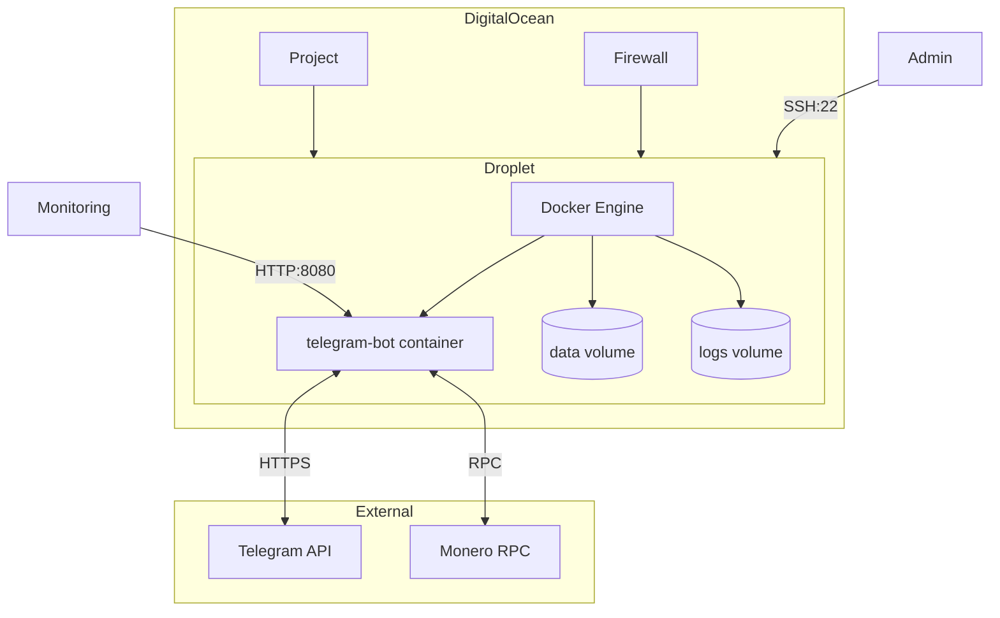

# Infrastructure Overview

## Deployment Architecture

The bot is designed to run on a single VPS with Docker, managed via Terraform for infrastructure-as-code.

## Infrastructure Components

| Component | Purpose | Managed By |
|-----------|---------|------------|
| Droplet | Ubuntu 24.04 VM | Terraform |
| Firewall | Network security | Terraform |
| SSH Key | Admin access | Terraform |
| Project | Resource grouping | Terraform |
| Docker | Container runtime | cloud-init |
| systemd | Service management | cloud-init |

## Resource Sizing

| Size | vCPU | RAM | Cost | Use Case |
|------|------|-----|------|----------|
| s-1vcpu-1gb | 1 | 1GB | $6/mo | Development/Low traffic |
| s-1vcpu-2gb | 1 | 2GB | $12/mo | Production |
| s-2vcpu-2gb | 2 | 2GB | $18/mo | High traffic |

## Network Security

Firewall rules (managed by Terraform):

| Direction | Protocol | Port | Source | Purpose |
|-----------|----------|------|--------|---------|
| Inbound | TCP | 22 | Configurable | SSH access |
| Inbound | TCP | 8080 | Any | Health checks |
| Outbound | TCP/UDP | All | Any | Bot operation |

## Health Monitoring

- `/health` - Liveness probe (simple ping)
- `/ready` - Readiness probe (includes DB check)

These endpoints are exposed on port 8080 and can be used by external monitoring services.
