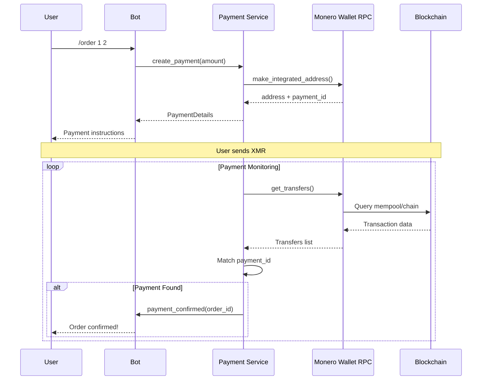
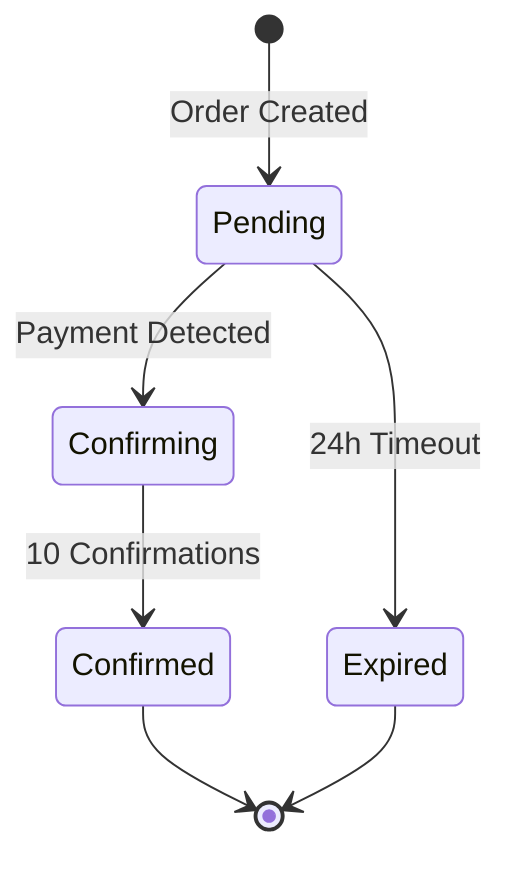

# Payment System Overview

## Design Philosophy

The payment system uses Monero (XMR) cryptocurrency for maximum privacy. Each order receives a unique integrated address, enabling automatic payment tracking without exposing user transaction history.

## Payment Flow



## Key Components

### MoneroPaymentService

Handles all Monero-related operations:

```python
class MoneroPaymentService:
    def __init__(self):
        self.settings = get_settings()
        self._wallet = None

    def create_address(self) -> Tuple[str, str]:
        """Create a new payment address with unique payment ID.
        Returns (integrated_address, payment_id)."""

    def check_paid(self, payment_id: str, expected_amount: Decimal = None) -> bool:
        """Check if payment has been received."""

    def get_balance(self) -> Decimal:
        """Get wallet balance."""
```

Note: `PaymentService` is an alias for `MoneroPaymentService` for backward compatibility.

### Return Values

The `create_address()` method returns a tuple:

```python
address, payment_id = payment_service.create_address()
# address: Monero integrated address string
# payment_id: UUID hex string for tracking
```

## Payment States



| State | Description |
|-------|-------------|
| Pending | Awaiting payment |
| Confirming | Payment in mempool or < 10 confirmations |
| Confirmed | Payment confirmed (10+ confirmations) |
| Expired | Payment window closed |

## Integrated Addresses

Monero integrated addresses combine a standard address with a payment ID:

```
Standard Address (95 chars):
4AdUndXHHZ6cfufTMvppY6JwXNouMBzSkbLYfpAV5Usx3skxNgYeYTRj5UzqtReoS44qo9mtmXCqY45DJ852K5Jv2684Rge

Payment ID (16 hex chars):
1234567890abcdef

Integrated Address (106 chars):
4JxzBD7SXvABLnYgMxdPRf7iVpfh4kMnfNWoM6ixWjJe7FzkjyBd1mA3VvhxTKJ5Usx3skxNgYeYTRj5UzqtReoS4DnHKFBUhXP
```

Benefits:
- No need for separate payment ID in transaction
- Automatic payment attribution
- Privacy preserved (payment ID encrypted in transaction)

## Configuration

```bash
# Required for production
MONERO_RPC_URL=http://localhost:18082/json_rpc

# Optional
MONERO_RPC_USER=rpc_user
MONERO_RPC_PASSWORD=rpc_password
PAYMENT_TIMEOUT_HOURS=24
REQUIRED_CONFIRMATIONS=10
```

## Mock Mode

When `MONERO_RPC_URL` is not set or connection fails, the service falls back to mock mode in development:

```python
# In create_address()
if self.settings.environment == "development":
    address = f"4A{payment_id[:10]}..."  # Mock address
    return address, payment_id

# In check_paid()
if self.settings.environment == "development":
    return True  # Auto-confirm in dev
```

Mock mode allows:
- Development without Monero node
- Testing payment flows
- CI/CD pipeline execution
