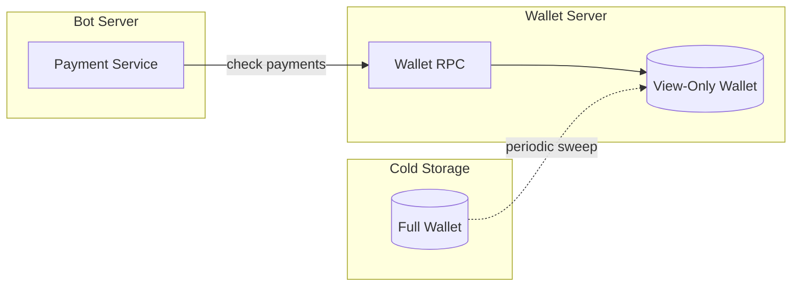

# Payment Security

## Security Model

### Threat Landscape

| Threat | Impact | Mitigation |
|--------|--------|------------|
| Payment ID collision | Incorrect order attribution | 64-bit random IDs (collision probability ~1e-19) |
| Underpayment | Revenue loss | Strict amount verification |
| Double-spend | Fraudulent orders | Wait for confirmations |
| RPC compromise | Fund theft | Wallet isolation, view-only wallets |
| Address manipulation | Funds sent to attacker | Server-side address generation |

### Security Properties

1. **Payment Isolation**: Each order gets unique integrated address
2. **Amount Verification**: Exact amount matching required
3. **Confirmation Requirement**: 10 confirmations before fulfillment
4. **Expiration**: Payments expire after 24 hours

## Payment Verification

### Confirmation Requirements

```python
REQUIRED_CONFIRMATIONS = 10  # ~20 minutes on Monero

async def is_payment_confirmed(
    self,
    payment_id: str,
    expected: Decimal
) -> bool:
    transfers = await self.get_transfers(payment_id)

    for tx in transfers:
        if tx["confirmations"] < REQUIRED_CONFIRMATIONS:
            continue

        received = piconero_to_xmr(tx["amount"])
        if received >= expected:
            return True

    return False
```

### Amount Tolerance

For floating-point safety, allow minimal tolerance:

```python
AMOUNT_TOLERANCE = Decimal("0.000000000001")  # 1 piconero

def amounts_match(expected: Decimal, received: Decimal) -> bool:
    return abs(expected - received) <= AMOUNT_TOLERANCE
```

## Wallet Security

### View-Only Wallet Option

For maximum security, use a view-only wallet for payment monitoring:

```bash
# Create view-only wallet from primary
monero-wallet-cli --generate-from-view-key view-only-wallet

# Use view-only for RPC (can see incoming, cannot spend)
monero-wallet-rpc --wallet-file view-only-wallet ...
```

### Wallet Isolation



### Access Control

```python
# Restrict RPC access
MONERO_RPC_BIND = "127.0.0.1"  # Local only
MONERO_RPC_ALLOWED_IPS = ["10.0.0.5"]  # Bot server IP

# Use authentication
MONERO_RPC_USER = "bot_service"
MONERO_RPC_PASSWORD = secrets.token_urlsafe(32)
```

## Attack Mitigations

### Double-Spend Prevention

```python
async def handle_payment_detected(self, tx: dict, order: Order):
    # Don't confirm until sufficient confirmations
    if tx["confirmations"] < REQUIRED_CONFIRMATIONS:
        order.status = OrderStatus.CONFIRMING
        await self.notify_user(
            order.user_id,
            f"Payment detected! Waiting for confirmations ({tx['confirmations']}/{REQUIRED_CONFIRMATIONS})"
        )
        return

    # Verify not already processed
    if order.status == OrderStatus.CONFIRMED:
        logger.warning(f"Duplicate confirmation for order {order.id}")
        return

    # Confirm order
    order.status = OrderStatus.CONFIRMED
    order.paid_at = datetime.utcnow()
```

### Race Condition Prevention

```python
from sqlalchemy import update
from sqlalchemy.orm import Session

async def confirm_order_atomic(self, session: Session, order_id: int) -> bool:
    """Atomically confirm order if still pending."""
    result = session.execute(
        update(Order)
        .where(Order.id == order_id)
        .where(Order.status == OrderStatus.PENDING)
        .values(status=OrderStatus.CONFIRMED, paid_at=datetime.utcnow())
    )
    session.commit()
    return result.rowcount > 0
```

### Payment Replay Prevention

Track processed transactions to prevent replay:

```python
processed_txids: set[str] = set()

async def process_transfer(self, tx: dict):
    txid = tx["txid"]

    if txid in processed_txids:
        return  # Already processed

    # Process payment...

    processed_txids.add(txid)
```

## Monitoring and Alerts

### Payment Anomalies

```python
async def check_payment_anomalies(self, order: Order, tx: dict):
    received = piconero_to_xmr(tx["amount"])
    expected = order.total

    if received < expected:
        await self.alert_admin(
            f"Underpayment for order {order.id}: "
            f"expected {expected}, received {received}"
        )

    if received > expected * Decimal("1.1"):  # >10% overpayment
        await self.alert_admin(
            f"Significant overpayment for order {order.id}: "
            f"expected {expected}, received {received}"
        )
```

### Security Logging

```python
security_logger = logging.getLogger("payments.security")

def log_payment_event(event: str, order_id: int, details: dict):
    security_logger.info(
        event,
        extra={
            "order_id": order_id,
            "timestamp": datetime.utcnow().isoformat(),
            **details
        }
    )

# Usage
log_payment_event("payment_confirmed", order.id, {
    "amount": str(received),
    "txid": tx["txid"],
    "confirmations": tx["confirmations"]
})
```

## Checklist

- [ ] Required confirmations set to 10+
- [ ] Exact amount verification enabled
- [ ] View-only wallet for payment monitoring
- [ ] RPC authentication configured
- [ ] RPC bound to localhost or VPN
- [ ] Payment expiration enforced
- [ ] Transaction deduplication implemented
- [ ] Security events logged
- [ ] Admin alerts configured
